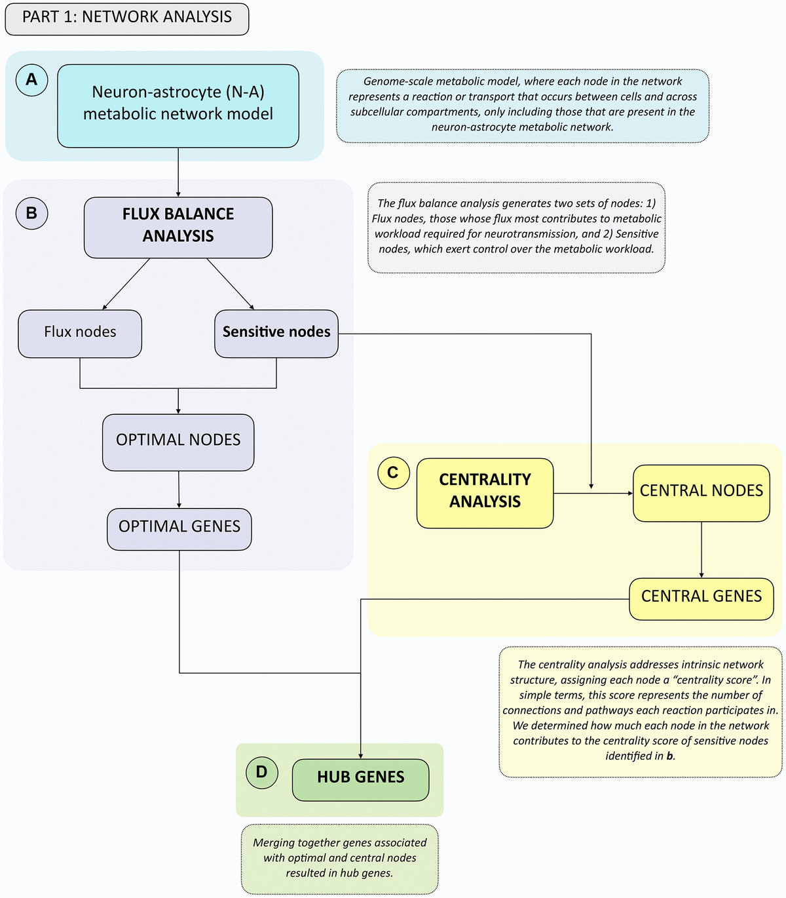

# Metabolic switch in the aging astrocyte supported via integrative approach comprising network and transcriptome analyses

This repository contains the code for the calculations of the centralities and fluxes from the metabolic network as described in our research paper. 

## Authors:

- Alejandro Acevedo, Instituto de Nutrición y Tecnología de Alimentos (INTA), Universidad de Chile, Santiago, Región Metropolitana 7800003, Chile 
- Felipe Torres, Department of Physics, Universidad de Chile, Santiago, Región Metropolitana 7800003, Chile; Center for the Development of Nanoscience and Nanotechnology, CEDENNA, Santiago, Región Metropolitana 7800003, Chile; Department of Physics, Center for Advanced Nanoscience, University of California, San Diego, CA 92093, USA 
- Miguel Kiwi, Department of Physics, Universidad de Chile, Santiago, Región Metropolitana 7800003, Chile; Center for the Development of Nanoscience and Nanotechnology, CEDENNA, Santiago, Región Metropolitana 7800003, Chile
- Felipe Baeza-Lehnert, Centro de Estudios Científicos (CECs), Valdivia 5110466, Chile
- (Additional authors here...)

The paper was received on December 22, 2022, accepted on March 20, 2023, and published on April 18, 2023. 

## Abstract

Dysregulated central-energy metabolism is a hallmark of brain aging. Supplying enough energy for neurotransmission relies on the neuron-astrocyte metabolic network. To identify genes contributing to age-associated brain functional decline, we formulated an approach to analyze the metabolic network by integrating flux, network structure, and transcriptomic databases of neurotransmission and aging.

Our findings support that during brain aging:
1. The astrocyte undergoes a metabolic switch from aerobic glycolysis to oxidative phosphorylation, decreasing lactate supply to the neuron, while the neuron suffers an intrinsic energetic deficit by downregulation of Krebs cycle genes, including mdh1 and mdh2 (Malate-Aspartate Shuttle);
2. Branched-chain amino acid degradation genes were downregulated, identifying dld as a central regulator;
3. Ketone body synthesis increases in the neuron, while the astrocyte increases their utilization, in line with neuronal energy deficit in favor of astrocytes.

We identified candidates for preclinical studies targeting energy metabolism to prevent age-associated cognitive decline.

For more details, please refer to the [full paper](https://pubmed.ncbi.nlm.nih.gov/37074814/).

# Centrality Analysis

The `centralities.py` script performs centrality analysis on a network by calculating various centralities and analyzing the effects of removing specific nodes on the network's centralities. The analysis is performed using the NetworkX library in Python, with distributed computation capabilities provided by Ray.

## Functionality

- `get_largest_connected_component(graph: nx.Graph) -> nx.Graph`: Finds and returns the largest connected component of a graph.
- `calculate_quick_centralities(graph: nx.Graph) -> pd.DataFrame`: Computes fast-to-calculate centralities such as degree centrality, eigenvector centrality, closeness centrality, and information centrality.
- `calculate_centralities(graph: nx.Graph, use_quick_measurements: bool = False, alpha: float = 0.005) -> pd.DataFrame`: Computes multiple centralities including degree centrality, harmonic centrality, eigenvector centrality, betweenness centrality, closeness centrality, load centrality, information centrality, katz centrality, and pagerank centrality.
- `compute_alpha_for_graph(graph: nx.Graph) -> float`: Calculates the alpha parameter for Katz centrality and PageRank based on the largest eigenvalue of the graph.
- `remove_node_and_calculate_centralities(graph: nx.Graph, node_to_remove, verbose: bool = False)`: Removes a node from the graph and calculates centralities for the remaining nodes.
- `remove_nodes_and_calculate_centralities(graph: nx.Graph, nodes_to_remove: list)`: Removes multiple nodes from the graph and calculates centralities after each removal.

## Usage

1. Install the required dependencies: `networkx`, `pandas`, `ray`, and other necessary packages.
2. Customize the input graph file path (`graphml_path`) and the nodes to remove (`to_remove`) in the `centralities.py` script.
3. Run the `centralities.py` script to perform centrality analysis on the network and obtain centralities with and without removed nodes.
4. The centralities are stored in the `centralidades_perturbadas` and `baseline` variables within the script.
5. The results are saved as a pickle file named `centralities.pickle`.
6. Check the log file `centralities.log` for any warnings or errors during the execution.

Please note that the script utilizes Ray, a distributed computing framework, to execute computations in parallel, which can significantly speed up the centrality analysis for large networks.

# Centrality Analysis with AWS

The `to_aws.sh` script automates the process of performing centrality analysis using Ray on an AWS cluster. It assumes you have an AWS cluster configured with Ray and the necessary dependencies.

## Usage

1. Ensure you have the required dependencies installed: Ray, AWS CLI, and other necessary packages.
2. Open a terminal and navigate to the directory where this script is located.
3. Configure the AWS cluster by modifying the `aws-ray-cluster.yml` file according to your cluster setup.
4. Ensure that your AWS credentials are correctly configured on your machine.
5. Customize the file paths and cluster configuration in the script as needed.
6. Run the script using the command: `./to_aws.sh`.
7. The script will start the AWS cluster using the provided cluster configuration file (`aws-ray-cluster.yml`).
8. It will then upload the input graph file (`graph.graphml`) to the cluster using `ray rsync-up`.
9. Next, it will submit the `centralities.py` script to the cluster for centrality analysis using `ray submit`.
10. Once the analysis is completed, it will download the results and logs from the cluster using `ray rsync-down` and save them to the `aws-downloads` directory.
11. Review the downloaded files (`centralities.log` and `centralities.pickle`) for the analysis results and logs.

Please note that you need to configure the cluster and input files before running this script. Modify the file paths and cluster configuration (`aws-ray-cluster.yml`) according to your setup.

Ensure that your AWS credentials are correctly configured on your machine to access the AWS cluster.

Feel free to modify and expand this description according to your specific needs and include any additional information about the project or the script.

# Centrality Variations

This Jupyter Notebook, `centrality_variations.ipynb`, performs centrality analysis on a network by calculating the log2 ratio centrality variations for each reaction. It uses the `pickle`, `pandas`, and `numpy` libraries for data manipulation and analysis.

## Functionality

- `load_data(file_path: str) -> Tuple[pd.DataFrame, pd.DataFrame]`: Loads data from a pickle file and returns the `centralidades_perturbadas` and `baseline` DataFrames.
- `concat_centralities(baseline: pd.DataFrame, centralidades_perturbadas: List[pd.DataFrame]) -> pd.DataFrame`: Concatenates the `baseline` and `centralidades_perturbadas` DataFrames into a single DataFrame.
- `log2RatioCentrality(baseline: pd.DataFrame, centralidades_df: pd.DataFrame, a_rxn: str) -> pd.DataFrame`: Computes the log2 ratio of baseline centralities to the centralities of a given reaction.
- `get_centrality_variation(variation_function, rxns: List[str]) -> pd.DataFrame`: Applies the variation function to a list of reactions and consolidates the results into a single DataFrame.

## Usage

1. Ensure you have the required dependencies installed: `pickle`, `pandas`, and `numpy`.
2. Open the `centrality_variations.ipynb` Jupyter Notebook.
3. Customize the `file_path` variable in the first code cell to point to your input pickle file.
4. Run the notebook to perform centrality analysis and calculate the log2 ratio centrality variations.
5. The resulting variations will be saved as a compressed parquet file named `log2Ratio_df.parquet.gzip`.

Please note that the code assumes the input pickle file contains the `centralidades_perturbadas` and `baseline` DataFrames. Make sure to provide the correct file path to load your data.

Refer to the comments within the notebook for detailed explanations of each function and additional information on the centrality analysis process.

Feel free to modify and expand this description according to your specific needs and include any additional information about the project or the code.